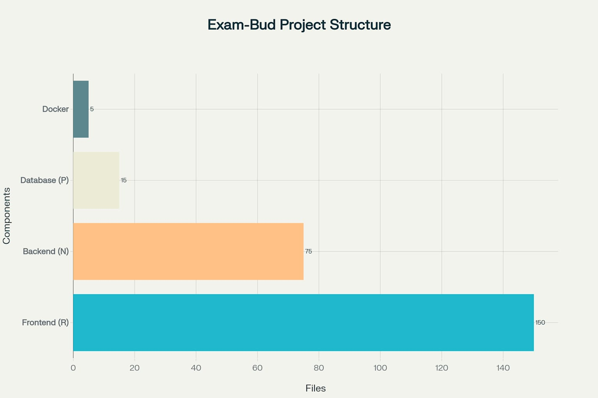

# 📚 EXAM-BUD

<p align="center">
  
</p>

<div align="center">

[](https://github.com/bsoc-bitbyte/Exam-Bud/stargazers)
[](https://github.com/bsoc-bitbyte/Exam-Bud/network/members)
[](https://github.com/bsoc-bitbyte/Exam-Bud/issues)
[](https://github.com/bsoc-bitbyte/Exam-Bud/graphs/contributors)
[](https://github.com/bsoc-bitbyte)


</div>

## 🔍 Overview

Exam-Bud is a collaborative platform developed by students of IIITDM Jabalpur to solve the age-old problem of scrambling for study materials during exam season. Built during the BitByte Summer of Code event, this platform aims to create a centralized hub where students can:

- 📝 Share and access lecture notes and study materials
- 📚 Upload and download previous year question papers
- 💬 Participate in dedicated discussion forums for each subject
- 🔔 Get notifications about new materials in subscribed courses
---

## 🧠 Features That Actually Solve Real Problems

<table>
  <tr>
    <td>
      <h3>📝 Notes Sharing</h3>
      <p>Found someone's notes from last year that saved your life? Pay it forward. Upload and share notes with your classmates. <i>Because not all heroes wear capes, some just share PDFs.</i></p>
    </td>
    <td>
      <h3>💬 Discussion Forums</h3>
      <p>That moment when you're stuck on a problem at 2 AM and everyone else is awake too because #ExamSeason. Ask questions, get answers, share memes. <i>We're all in this together.</i></p>
    </td>
  </tr>
  <tr>
    <td>
      <h3>🤝 Collaborative Study</h3>
      <p>Form study groups, share resources, and pretend you've been studying all semester when you've actually been binging Netflix. <i>No judgment here.</i></p>
    </td>
    <td>
      <h3>📱 Mobile-Friendly</h3>
      <p>Access notes from anywhere - whether you're at the library pretending to study, or in bed actually studying. <i>We've got you covered.</i></p>
    </td>
  </tr>
  <tr>
    <td>
      <h3>🔐 Secure Access</h3>
      <p>Only verified IIITDM students can join. No professors allowed (we're kidding... maybe). <i>What happens in Exam-Bud stays in Exam-Bud.</i></p>
    </td>
    <td>
      <h3>🚀 Lightning Fast</h3>
      <p>Because when you're looking for notes 10 minutes before the exam, every second counts. <i>We've optimized for panic-browsing.</i></p>
    </td>
  </tr>
</table>


---

## 🛠️ Tech Stack 

Our tech stack is as robust as your excuses for not studying earlier:

| Frontend | Backend | Database | DevOps |
|:--------:|:-------:|:--------:|:------:|
|  |  |  |  |
|  |  | |  |
|  | | | |

</div>

---

## 🏗️ Project Architecture

<p align="center">
  
</p>

## 🎨 Design & UI

Our UI is designed with the sleep-deprived student in mind - simple, intuitive, and caffeine-friendly.

<div align="center">
  <a href="https://www.figma.com/design/3NruGfT09LfcDhi3QDxZSt/Exam-Bud?node-id=368-3497&t=9jbRPU9RlKRDlgHH-0">
    
  </a>
</div>

---

## 🚦 Getting Started 


### Wants to setup locally? check out [SETUP.md](./SETUP.md)
### Prerequisites

- Docker (because we're fancy like that)
- Node.js (the backbone of modern web)

### The "I Just Want It Working" Quick Setup

```bash
# Clone the repo (like copying your friend's notes)
git clone https://github.com/bsoc-bitbyte/Exam-Bud.git

# Enter the project directory (like entering exam hall - with fear and trembling)
cd Exam-Bud

# In the backend folder, rename .env.sample to .env (the digital equivalent of finding the cheat sheet)
cd backend
mv .env.sample .env
npm install

# Go back to root (like going back to basics when you're confused in an exam)
cd ..

# Enter frontend directory (frontend = what people actually see, like your face during an exam)
cd frontend
npm install

# Go back to root again (you're getting good at this navigation thing!)
cd ..

# Fire up Docker (like firing up your brain cells at 3 AM)
docker compose up --build -d

# Open your browser and go to:
# localhost:3001
```

If you see the app running, congratulations! You've done more work setting this up than you probably did studying for your last exam!

## 🧪 Techstack Learning Resources

Feeling lost? Here are some resources:

- **JavaScript** – [Beginner-friendly JS tutorial](https://javascript.info/)
- **TailWind CSS** – [TailWind CSS tutorial](https://tailwindcss.com/docs/installation)
- **React JS** – [React JS Tutorial](https://react.dev/learn)
- **Node JS** – [Node JS Crash Course](https://www.youtube.com/watch?v=fBNz5xF-Kx4)
- **PostgreSQL** – [PostgreSQL Crash Course](https://www.youtube.com/watch?v=qw--VYLpxG4)

## 🤝 Contributing (Because We Need All The Help We Can Get)

Want to contribute? Amazing! Check out our [CONTRIBUTING.md](./CONTRIBUTING.md) guide.

Remember:
- We use conventional commits (feat, fix, docs, etc.)
- We welcome all contributions, especially from those procrastinating on their own studies
- No contribution is too small (except maybe that one assignment you didn't do)

## 💭 Quotes to Make You Feel Better About Procrastinating

> "I don't need Stack Overflow, I am Stack Overflow." — Every CS student right before a major bug

> "Software is like sex: it's better when it's free." — Linus Torvalds

> "I am a lazy person, which is why I like open source, for other people to do work for me." — Also Linus Torvalds (he's a gold mine)

> "It compiles; ship it!" — Every developer ever, moments before disaster

## 📊 Project Stats (Because Numbers Make Everything Look Official)

<table>
  <tr>
    <td>✨ Stars:</td>
    <td>10 (and counting!)</td>
  </tr>
  <tr>
    <td>🍴 Forks:</td>
    <td>34 (more than the forks in the college Nescafe)</td>
  </tr>
  <tr>
    <td>👀 Watchers:</td>
    <td>1 </td>
  </tr>
  <tr>
    <td>👨‍💻 Contributors:</td>
    <td>4 amazing individuals who probably should be studying</td>
  </tr>
</table>

## 📜 License

This project is licensed under the IIITDMJ License - see the [LICENSE](LICENSE) file for details.

In human terms: Feel free to use, modify, and distribute this code, just don't blame us if it doesn't work as expected (much like those last-minute notes you borrowed).

## 👥 Maintainers

<div align="center">

|  |  |
|:--:|:--:|
| [Ritankar Saha](https://github.com/ritankarsaha) | [Harshiill](https://github.com/harshiill) |

</div>

---

<div align="center">
  <h3>Made with ❤️ and a concerning amount of caffeine by students, for students</h3>
  <p>Copyright © 2025 BSOC-BitByte | "Because sleep is overrated during exam season"</p>
</div>

<p align="center">
  <a href="#"></a>
</p>